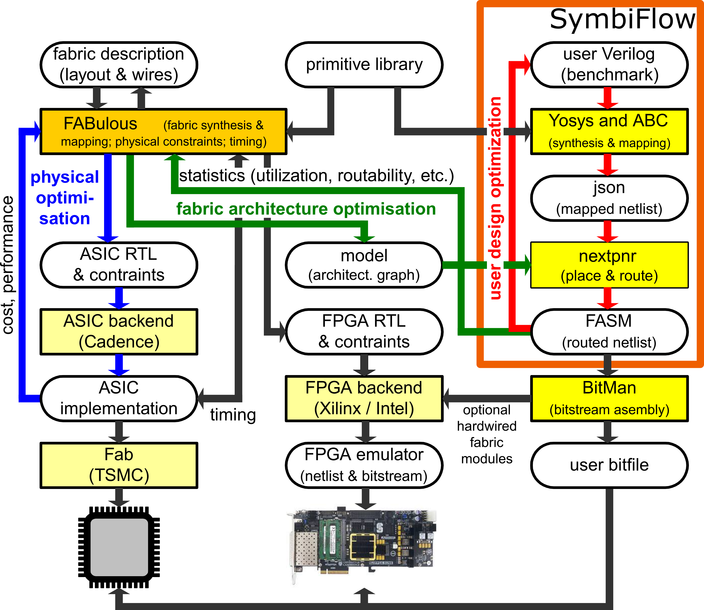

# FABulous: an Embedded FPGA Framework

[](https://opensource.org/licenses/Apache-2.0)

## Introduction

FABulous is designed to fulfill the objectives of ease of use, maximum portability to different process nodes, good control for customization, and delivering good area, power, and performance characteristics of the generated FPGA fabrics. The framework provides templates for logic, arithmetic, memory, and I/O blocks that can be easily stitched together, whilst enabling users to add their own fully customized blocks and primitives.

The FABulous ecosystem generates the embedded FPGA fabric for chip fabrication, integrates
[YosysHQ](https://github.com/YosysHQ/oss-cad-suite-build)
toolchain release packages, deals with the bitstream generation and provides after-fabrication tests. Additionally, we plan to provide an emulation path for system development.

This guide describes everything you need to set up your system to use the FABulous ecosystem, and the full project documentation can be found [here](https://fabulous.readthedocs.io/en/latest/).



## How to cite

The following paper can be used to cite FABulous:

Dirk Koch, Nguyen Dao, Bea Healy, Jing Yu, and Andrew Attwood. 2021. FABulous: An Embedded FPGA Framework. In <i>The 2021 ACM/SIGDA International Symposium on Field-Programmable Gate Arrays</i> (<i>FPGA '21</i>). Association for Computing Machinery, New York, NY, USA, 45–56. DOI: https://doi.org/10.1145/3431920.3439302

[Link to Paper](https://dl.acm.org/doi/pdf/10.1145/3431920.3439302)

## Prerequisites

The following packages need to be installed for generating fabric HDL models and using the FABulous front end:

- Python 3.9 or later

Install python dependencies

```
pip3 install -r requirements.txt
sudo apt-get install python3-tk
```

The following packages need to be installed for the CAD toolchain
 - [Yosys](https://github.com/YosysHQ/yosys)
 - [nextpnr-generic](https://github.com/YosysHQ/nextpnr#nextpnr-generic)
 
 A flow using VPR, the place and route tool from the [VTR project](https://github.com/verilog-to-routing/vtr-verilog-to-routing) is also available. However, this still requires Yosys, as well as the FABulous nextpnr fork, since this contains files for design synthesis.

## Getting started

To set up FABulous:

```
git clone https://github.com/FPGA-Research-Manchester/FABulous
cd FABulous
export FAB_ROOT=`pwd`
```

We have provided a Python Command Line Interface (CLI) as well as a project structure for easy access of the FABulous toolchain.

The `Tile` folder contains all the definitions of the fabric primitive as well as the fabric matrix configuration. `fabric.csv` is what defining the architecture of the fabric. The FABulous project folder also contains a `.FABulous` folder which contains all the metadata during the generation of the fabric.

We can initiate the FABulous shell with `python3 FABulous.py <project_dir>`. After that you will see a shell interface which allow for interactive fabric generation. To generate a fabric we first need to run `load_fabric [fabric_CSV]` to load in the fabric definition. Then we can call `run_FABulous_fabric` to generate a fabric.

To generate a model and bitstream for a specific design call `run_FABulous_bitstream npnr <dir_to_top>` which will
generate a bitstream for the provided design in the same folder as the design.

To exit the shell simply type `exit` and this will terminate the shell.

A demo of the whole flow:

```
python3 FABulous.py -c demo
# In the FABulous shell (python3 FABulous.py demo)
load_fabric
run_FABulous_fabric
run_FABulous_bitstream npnr ./user_design/sequential_16bit_en.v
exit
```

To run a simulation of a test bitstream on the design with Icarus Verilog:

```
cd demo/Test
./build_test_design.sh
./run_simulation.sh
```

The tool also supports using TCL script to drive the build process. Assuming you have created a demo project using
`python3 FABulous.py -c demo`, you can call `python3 FABulous.py demo -s ./demo/FABulous.tcl` to run the demo flow with the TCL interface.

More details on bitstream generation can be found [here](https://fabulous.readthedocs.io/en/latest/FPGA-to-bitstream/Bitstream%20generation.html).

Detailed documentation for the project can be found [here](https://fabulous.readthedocs.io/en/latest/index.html)
